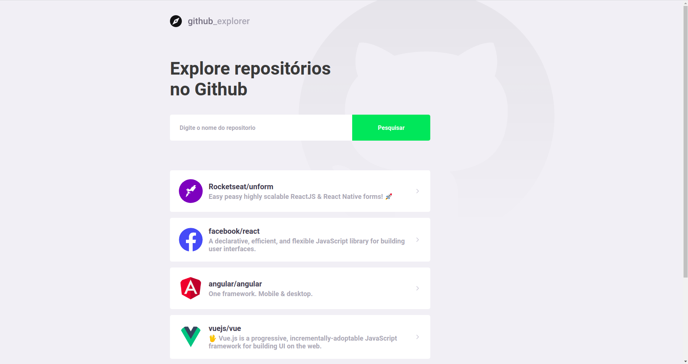
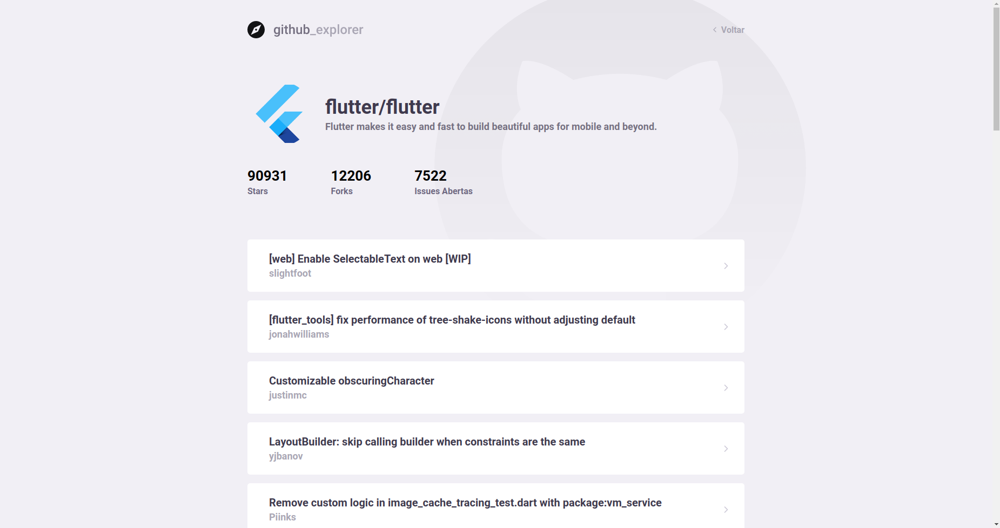

# 

### Salve seus repositórios favoritos e tenha suas issues de maneira rápida!
Sabe quando você acha aquele repositório cheio de informaçes que com certeza será útil em vários outros projetos? Que tal te-los de forma rápida e simples? 

## Ferramentas Utilizadas:
- ReactJS
- TypeScript

## Tela Inicial

## Repositório com issues

## Para Executar:
1- Clone o projeto
2- Rode yarn ou npm install para instalar as dependencias
3- Rode yarn start
4- Aproveite!
